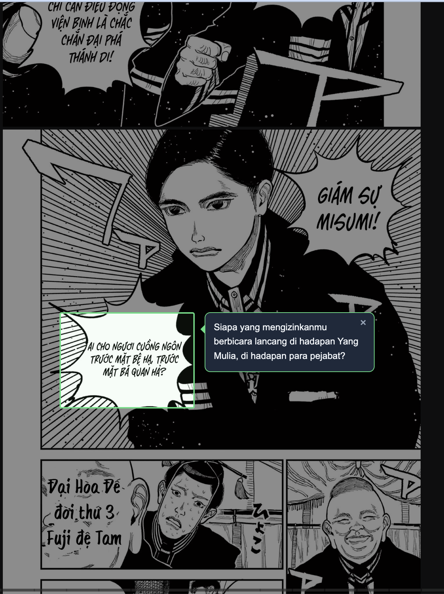
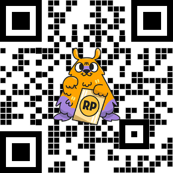

# Manga Translator

A Chrome extension that lets you drag-select any manga speech bubble and instantly get a translated sticky note beside it. Uses Vision LLM (no OCR pipeline) for accurate results on stylized manga fonts. Free via OpenRouter.



---

## Features

- **Two translation modes** — Drag Select for precise bubble targeting, Full Page for translating an entire page at once
- **Vision LLM** — OCR + translation in a single request, handles stylized manga fonts accurately
- **Draggable panels** — sticky note and translation panel can be repositioned freely
- **Manga reading order** — Full Page mode returns translations right-to-left, top-to-bottom
- **Multiple source languages** — Japanese, Vietnamese, English, Chinese, Korean
- **Multiple target languages** — Indonesian, Vietnamese, English
- **Custom model** — pick from the dropdown or type any OpenRouter model ID
- **Zero dependencies** — no Node.js, no webpack, no build step

---

## Installation

### 1. Clone / Download

```bash
git clone https://github.com/username/manga-translator
cd manga-translator
```

### 2. Load into Chrome

1. Open `chrome://extensions`
2. Enable **Developer mode** (top-right toggle)
3. Click **Load unpacked** → select the `manga-translator` folder

### 3. Set up API Key

1. Sign up for free at [openrouter.ai](https://openrouter.ai)
2. Create an API key at [openrouter.ai/keys](https://openrouter.ai/keys)
3. Click the extension icon → paste your key into the **OpenRouter API Key** field

---

## Usage

1. Open any manga page (MangaDex, etc.)
2. Click the extension icon → configure languages and model → toggle **Aktifkan** (Enable)
3. The cursor turns into a crosshair over images
4. Pick a mode:

### Mode 1 — Drag Select
- **Click and drag** over a specific speech bubble
- A sticky note appears beside the selection with the translation
- Click **×** to dismiss, or drag a new area
- Sticky note is **draggable** — reposition it anywhere on screen

### Mode 2 — Full Page
- **Click** anywhere on the manga image
- The entire page is sent to the Vision LLM at once
- A translation panel appears at the bottom-right of the image, listing all bubbles in **manga reading order** (right-to-left, top-to-bottom)
- The panel is **draggable** — grab the header to move it

---

## Models

Open the popup → **Model** field. Default: `Qwen2.5 VL 72B (free)`.

| Model | Quality | Notes |
|-------|---------|-------|
| `qwen/qwen2.5-vl-72b-instruct:free` | ⭐⭐⭐⭐⭐ | Best for Asian manga |
| `meta-llama/llama-4-scout:free` | ⭐⭐⭐⭐ | Stable, fast |
| `meta-llama/llama-4-maverick:free` | ⭐⭐⭐⭐ | Good alternative |
| `google/gemini-2.0-flash-exp:free` | ⭐⭐⭐⭐ | Great but occasionally offline |
| `microsoft/phi-4-multimodal-instruct:free` | ⭐⭐⭐ | Lightweight |

All models above are **free** on OpenRouter (~20 req/min rate limit).

Browse more vision models: [openrouter.ai/models?supported_parameters=vision](https://openrouter.ai/models?supported_parameters=vision)

If you get a `"no endpoints"` error, the model is temporarily offline — just switch to another one.

---

## Architecture

**Mode 1 — Drag Select**
```
User drags selection box
        │
        ▼
content.js crops the region (canvas, 2× upscaled)
        │
        ▼
background.js fetches image (CORS bypass)
        │
        ▼
OpenRouter — Vision LLM: OCR + translate in one request
        │
        ▼
Draggable sticky note beside the selection
```

**Mode 2 — Full Page**
```
User clicks image
        │
        ▼
background.js fetches full image (CORS bypass)
        │
        ▼
OpenRouter — Vision LLM: detect all bubbles + translate
            ordered right-to-left, top-to-bottom (manga order)
        │
        ▼
Draggable panel at bottom-right with numbered translations
```

**Why Vision LLM instead of Tesseract?**
Tesseract is trained on standard print documents — stylized manga fonts, extreme italics, and speech bubble layouts produce garbled output. Vision LLMs (Qwen, Llama, Gemini) handle these accurately because they're trained on a far wider variety of text-in-image data.

---

## File Structure

```
manga-translator/
├── manifest.json       # Chrome extension config (MV3)
├── content.js          # UI logic: drag selection, sticky note, OpenRouter call
├── background.js       # Service worker: image fetching with CORS bypass
├── popup.html/js       # Extension popup: settings
├── styles.css          # Selection box, sticky note, toast, loading styles
└── icons/              # Extension icons
```

---

## Limitations

- Free OpenRouter models can go offline — switch to another model if you get a `"no endpoints"` error
- Accuracy drops on heavily decorative fonts or extreme text angles
- Some sites block cross-origin image fetching from extensions
- Free tier rate limit: ~20 requests/minute

---

## Support

If this extension saves you from reading manga you don't understand — consider buying me a coffee ☕

<a href="https://saweria.co/muhamadadam20" target="_blank">
  
</a>

---

## License

MIT
